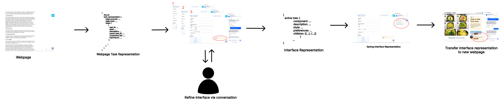
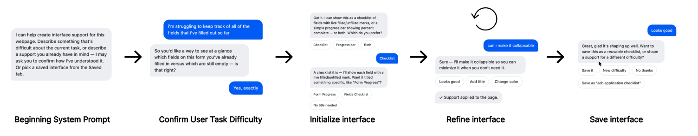
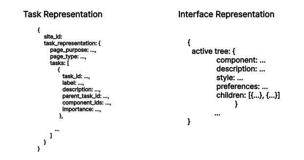
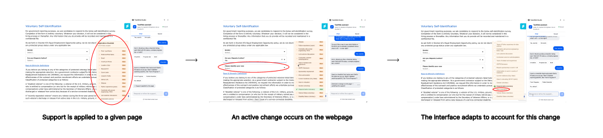
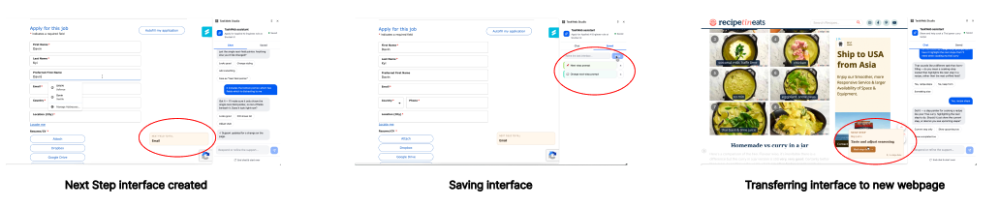
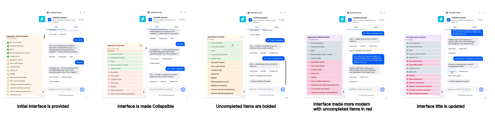
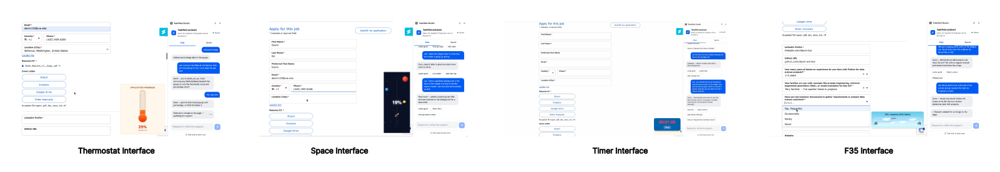

# TaskWeb Studio

TaskWeb is a prototype for **authoring webpage interface support through chat**. You describe a
difficulty you have with a page; TaskWeb helps you shape a reusable support concept, then realizes it
as a small widget grounded in that page's real elements — a live checklist, a progress tracker, a
"what's left" panel, whatever you and the assistant land on.

## Folders, at a glance

| Folder | Purpose | README |
|---|---|---|
| `plugin/` | The Chrome extension a user actually installs — WXT + React. Reads the page, chats with the backend, and hosts the generated widget on the page in a sandboxed iframe. | [plugin/PageAssist_plugin.md](plugin/PageAssist_plugin.md) |
| `backend/` | FastAPI + Claude service. Turns a page's real elements plus a user's chat-shaped preferences into the concrete widget the plugin displays. `api/` = `endpoints/<domain>/` (routes) + `state/` (in-process data) + `utils/` (shared infra); `definitions/<domain>/` = `prompts.py` + `schema.py` (what the model is told, no behavior). | [backend/PageAssist_backend.md](backend/PageAssist_backend.md) |
| `tests/` | All tests for both halves, run as plain scripts (no pytest/vitest) against the real production code. | [tests/PageAssist_Tests.md](tests/PageAssist_Tests.md) |

Each of those has its own README with the full file-by-file breakdown — this one stays at the
system level: what the three representations are, and how a request flows end to end.

## The three representations

Everything in the system is one of three linked representations:

- **Task representation** — a task-aware semantic model of **one specific webpage**, grounded strictly
  in its real, visible elements. Two flat tiers:
  `{page_purpose, page_type, tasks[], components[], modeling_notes}`.
  `tasks` are coarse goals (hierarchy via `parent_task_id`); `components` carry per-question
  granularity — **each individual form field is its own component**, since that's what completion
  tracking targets — with selectors copied verbatim from the DOM. Rebuilt per page; never fabricated.

- **Interface representation** — a single, **webpage-agnostic** set of support preferences, shaped
  entirely through chat against a generic preview. Shape:
  `{component, description, style, preferences, children[]}` where `style` is real CSS, `preferences`
  is short intent phrases (never literal page text), `description` is one plain sentence on what the
  support is, and `children` are structural groupings generic to the *kind* of task. One is "active"
  at a time; any can be saved to a reusable database and re-activated on a different site later.

- **Webpage interface** — the concrete widget for one site: its task representation realized through
  the active interface representation. Model-generated JavaScript that runs in a sandboxed iframe,
  plus a small host-managed `style` (frame position/size) and `state.items` (the real elements it
  tracks).

## How it fits together



The user provides a webpage. The webpage is turned into a task representation. TaskWeb uses that
task representation along with the user's preferences to produce a webpage interface that best
assists the user — while saving an interface representation that can be used to create webpage
interfaces on other webpages as well.

- The **content script** reads the page (for analysis), watches it for change, and hosts the widget
  iframe. It draws **no chrome** — the widget authors its own title bar / drag handle / close button
  and asks the host to act via a tiny `window.taskweb` API.
- The widget is only shown after the user **explicitly** activates a saved interface or agrees to one
  in chat. After that, a structural page change (a form control appears, a wizard step advances)
  regenerates the widget and updates it in place — but a widget never appears unbidden.
- Live completion state (a checklist ticking off as you fill fields) is read straight from the DOM by
  the content script — the model never computes or represents it.

## In practice

A visual walkthrough of the pipeline above, the conversation that drives it, and what the result
looks like on real pages. (Images live in `docs/assets/` — see the filenames below.)

### The conversation



The user is first given an introduction to the system. The user then voices their task difficulty,
and the system does its best to understand it. The user is offered options, or can author their own
interface from scratch. The user can then refine the interface and save it once it's complete.

### Task representation vs. interface representation



The task representation best represents the current task and the elements related to that task. The
interface representation is the best representation of the desired task-based interface *without*
being grounded in any given webpage — which is exactly what makes it reusable and adaptable to active
webpage changes (see the two contributions below).

### Actively adapting to webpage changes



Support is applied to a given page. An active change occurs on the webpage (here, answering "Are you
Hispanic/Latino?" reveals a follow-up race/ethnicity question). The interface adapts to account for
this change — without the user having to redo anything, and without a full re-analysis of the page.

### Transferring a task interface to a new page



An interface built for one page (a job application) is saved as a reusable interface representation.
Because that representation was never grounded in the job page's specific fields, the same concept can
be transferred and re-realized on a completely different page — here, a recipe site — with a widget
grounded in *that* page's own elements instead.

### Non-predefined authoring



There is no fixed widget template. The same starting checklist is reshaped entirely through
conversation — made collapsible, given bold styling for uncompleted items, restyled with a modern red
accent, and retitled — each change is genuinely new generated code, not a toggle on a preset.

### Further authored interface examples



A few more examples of what users have authored beyond checklists: a thermostat-style completion
gauge, a "spaceship" progress visualization, a countdown timer, and a dense multi-field tracker —
each grounded in a different real page, none from a predefined library.

## Design commitments

- **User authorship, not a fixed toolkit.** The widget is generated code, not a template. There is no
  predefined component library and no host-drawn UI furniture — anything the user sees, the model
  authored, within the sandbox.
- **Grounded, never fabricated.** Task elements and widget items are copied verbatim from the real
  DOM. The model is told to flatten or show less rather than guess missing structure.
- **Cost control.** Passive page-change events are gated by a structural-change heuristic, an
  agreement check, and a hard per-window cooldown before they can trigger a paid regeneration.
- **Isolation.** Model-generated code runs only in an `allow-scripts` (opaque-origin) iframe with
  `fetch`/`XHR`/`WebSocket`/`window.open` stripped — structurally unable to touch the real page.

## Getting started

See the per-part READMEs for full instructions. In short:

```sh
# backend
cd backend && python3 -m venv .venv && source .venv/bin/activate
pip install -r requirements.txt && uvicorn main:app --reload --port 8000

# plugin (separate terminal)
cd plugin && npm install && npm run dev
```

`npm run dev` opens a Chrome instance with the extension loaded; click its toolbar icon for the side
panel. Without `ANTHROPIC_API_KEY` / `ANTHROPIC_MODEL` set in `backend/.env`, every endpoint falls
back to a deterministic non-AI response so the app still runs.
